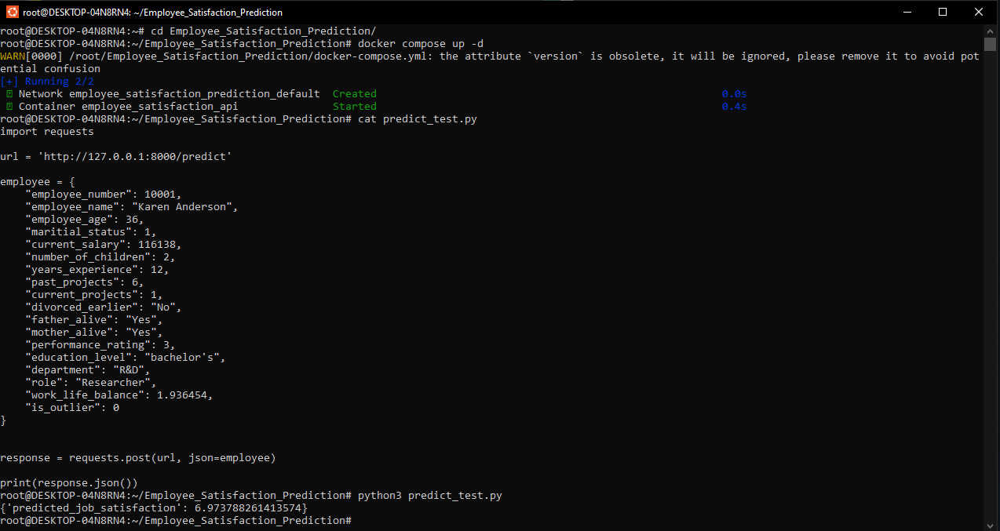

# Employee Satisfaction Prediction

## Project Description

This repository contains an end-to-end project that predicts employee job satisfaction from HR features (age, salary, education, role, performance, work-life balance, etc.). The project includes data preparation, exploratory data analysis, feature-importance analysis, model training/tuning, a FastAPI prediction service, and multiple deployment options (local uv, Docker, Docker Compose).

This README documents how to reproduce, run, and deploy the project and lists all deliverables.

---

## Usage ideas / Business applications

- Retention & Salary Hike Recommendations
  - Estimate how much salary increase would be needed to raise predicted satisfaction above a threshold.
  - Prioritize retention offers by predicted uplift vs cost (calculate predicted change if salary increases by X%).

- Identify Attrition Risk
  - Use low predicted satisfaction as a signal to flag employees for HR intervention.
  - Combine with other signals (performance drop, decreased projects, absenteeism) for early-warning systems.

- Promotion & Career Pathing
  - Use predictions together with performance and experience to suggest promotion candidates or targeted upskilling.

- Compensation Planning
  - Aggregate predicted satisfaction across teams/departments to prioritize budget allocation (where small increases produce large satisfaction gains).

- Workforce Segmentation
  - Segment employees by predicted satisfaction and other features to design targeted policies (e.g., flexible hours, training, mentoring).

---

## Deliverables (present in this repo)

- README.md — this file
- data.csv — dataset (or instructions to download below)
- notebook.ipynb — EDA, cleaning, feature importance, model selection & tuning
- train.py — trains the final model and saves model.bin
- predict.py — FastAPI serving script (loads model.bin)
- predict_test.py — example client to call the API
- model.bin — serialized pipeline (DictVectorizer + model) (if present)
- pyproject.toml, uv.lock — uv project and lockfile for reproducible deps
- Dockerfile — containerize the service
- docker-compose.yml — optional compose config

---

## Dataset (source + description)

Dataset origin: Cassandra Systems Inc. employee dataset (Kaggle)
Kaggle link: https://www.kaggle.com/datasets/rockyt07/cassandra-employee-dataset

Available files on Kaggle (summary):
- Employee_Complete_Dataset.csv — full 50,000 records
- Employee_Train_Dataset.csv — 45,000 rows for training
- Employee_Test_Dataset.csv — 5,000-row hold-out set
- Employee_Dataset.sql — SQL export for analytical queries

Columns used in this repo (example):
Employee_number, Employee_name, Employee_age, Maritial_Status, Current_Salary, Number_of_Children, years_experience, past_projects, current_projects, Divorced_earlier, Father_alive, Mother_alive, performance_rating, Education_level, Department, Role, Job_Satisfaction, Work_Life_Balance, is_outlier

If dataset is too large or proprietary, remove data.csv and add download instructions or Kaggle link. This repo assumes either data.csv exists or you will download Kaggle files and place them as data.csv.

---

## Quickstart — local (uv)

Prerequisite: uv installed.

1. Clone the repo:
git clone https://github.com/<your-username>/Employee_Satisfaction_Prediction.git
cd Employee_Satisfaction_Prediction

2. Create and sync environment:
uv sync

3. Train the model (optional):
uv run python train.py

4. Run the FastAPI server:
uv run uvicorn predict:app --host 0.0.0.0 --port 8000 --reload

5. API docs: open http://127.0.0.1:8000/docs

---

## Prediction API

Endpoint: POST /predict

Request example (JSON body):
{
  "employee_number": 10001,
  "employee_name": "Karen Anderson",
  "employee_age": 36,
  "maritial_status": 1,
  "current_salary": 116138,
  "number_of_children": 2,
  "years_experience": 12,
  "past_projects": 6,
  "current_projects": 1,
  "divorced_earlier": "No",
  "father_alive": "Yes",
  "mother_alive": "Yes",
  "performance_rating": 3,
  "education_level": "bachelor's",
  "department": "R&D",
  "role": "researcher",
  "work_life_balance": 1.936454,
  "is_outlier": 0
}

Response example:
{
  "predicted_job_satisfaction": 5.12
}

Notes:
- The API expects the same preprocessing conventions used during training (Yes/No fields, categorical formatting). The shipped predict.py includes forgiving parsing (drops job_satisfaction if present, handles Yes/No and True/False conversions).
- Input without job_satisfaction is supported for production use.

---

## Test client

Run the provided predict_test.py (modify url if needed):
uv run python predict_test.py
or
python predict_test.py

---

## Docker — build and run

Build:
docker build -t employee-satisfaction-api .

Run:
docker run -p 8000:8000 employee-satisfaction-api

Notes:
- The provided Dockerfile uses a two-stage build with uv in the builder stage and a slim runtime. To minimize image size, keep runtime dependencies limited to prediction-only packages (FastAPI, Uvicorn, XGBoost, numpy, pandas).
- To rebuild after dependency changes:
docker build --no-cache -t employee-satisfaction-api .

---

## Docker Compose

Start:
docker-compose up --build

Stop:
docker-compose down

---

## Deployment options

- Local development: use uv run uvicorn predict:app --reload (fast iteration).
- Containerized: build Docker image and run in any container host (Docker, Kubernetes).
- Cloud providers: push the image to a registry and deploy to AWS ECS, GCP Cloud Run, Azure Container Instances, or Kubernetes.
- Server services: create a systemd unit that runs the Uvicorn command from the uv-managed .venv.

---

## Notebook & analysis

notebook.ipynb demonstrates:
- Data cleaning and preprocessing (encoding, scaling)
- EDA and visualizations (distributions, correlations)
- Feature importance (mutual information for mixed types, model-based importance)
- Model selection and hyperparameter tuning (Randomized Search / Optuna recommendations)
- Baseline comparisons and final model evaluation (RMSE, residuals)

---

## Reproducibility & best practices

- All dependencies are tracked in pyproject.toml and pinned in uv.lock. Use uv sync to reproduce the exact environment.
- Keep model.bin (trained pipeline) and pyproject.toml/uv.lock updated when dependencies or model change.
- Do not commit large datasets if they cannot be shared; provide download instructions instead (Kaggle link supplied above).

---

## Files to include in the repo

- README.md (this file)
- notebook.ipynb
- train.py
- predict.py
- predict_test.py
- pyproject.toml, uv.lock
- Dockerfile, docker-compose.yml
- model.bin (optional) or instructions to generate it
- data.csv (or clear download instructions / Kaggle link)

---